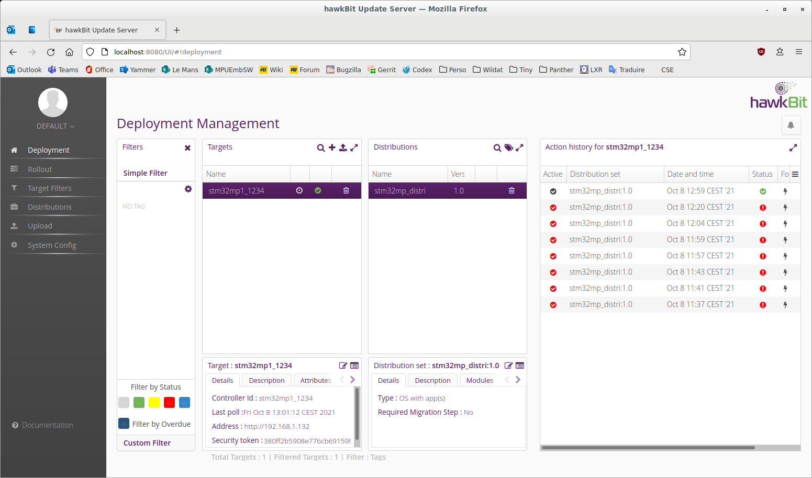

# meta-st-ota


## Overview
- This layer is used to demonstrate SW update OTA use case on STM32MPU boards.
- It uses A/B mechanism concept : all updatable partitions are duplicated : for example, rootfs becomes rootfs-a and rootfs-b. When a software running on rootfs-a is notified to be upgraded, the new version is installed on rootfs-b, and then system reboots on rootfs-b which becomes the new active version.
- The embedded client is [rauc](https://rauc.readthedocs.io/en/latest/) which get software updates from [Hawkbit](https://www.eclipse.org/hawkbit/) server. A glue layer called [rauc-hawkbit](https://github.com/rauc/rauc-hawkbit) polls the Hawkbit server to transmit new bundle to rauc.
- This layer is based on official DV-6.0 [openstlinux-24-11-06](https://wiki.st.com/stm32mpu/wiki/STM32_MPU_OpenSTLinux_release_note_-_v6.0.0) which also needs [rauc layer](https://github.com/rauc/meta-rauc).


## What's new in that release ?
This release is mostly an update to be able to run on top of ecosystem-v6.0.0, but I'd like to highlight several improvements:
- Support of STM32MP257F-EV1 board
- Ecosystem-v6.0.0 brings the support of new metadata partition: metadata v2 which is selected by default. metadata v1 is still supported in that layer but disabled by default.
- The root partition is described in the kernel cmdline as partuuid instead of partlabel
- rauc : partitions listed as partlabel in system.conf instead of hardcoded numbers

## Table of Contents
1. Documentation
2. HW requirements
3. SW requirements
4. How to add the meta-st-ota layer to your build ?
5. How to use the demo ?
6. Extra explanations
7. Limitations - issues


## 1. Documentation
- [STM32MPU-ecosystem-v6.0.0 Release note](https://wiki.st.com/stm32mpu/wiki/STM32_MPU_OpenSTLinux_release_note_-_v6.0.0)
- [STM32MP13 ressources](https://wiki.st.com/stm32mpu/wiki/STM32MP13_resources)
- [MP13 Disco schematic](https://wiki.st.com/stm32mpu/wiki/STM32MP13_resources#MB1635_schematics)
- [STM32MP15 ressources](https://wiki.st.com/stm32mpu/wiki/STM32MP15_resources)
- [MP15 Disco schematic](https://wiki.st.com/stm32mpu/wiki/STM32MP15_resources#MB1272_schematics)
- [STM32MP25 ressources](https://wiki.st.com/stm32mpu/wiki/STM32MP25_resources)
- [MP25 Eval schematic](https://wiki.st.com/stm32mpu/wiki/STM32MP25_resources#MB1936_schematics)
- [Rauc documentation](https://rauc.readthedocs.io/en/latest/)


## 2. HW requirements
A STM32MP135F-DK or STM32MP157F-DK2 or STM32MP157F-EV1 or STM32MP257F-EV1 is requested.


## 3. SW requirements
- This layer depends on [meta-rauc](https://github.com/rauc/meta-rauc).

## 4. How to add meta-st-ota layer to your build ?
### Install the [OpenSTLinux distribution](https://wiki.st.com/stm32mpu/wiki/STM32MPU_Distribution_Package#Installing_the_OpenSTLinux_distribution)

### Replace [Initializing the OpenEmbedded build environment chapter](https://wiki.st.com/stm32mpu/wiki/STM32MPU_Distribution_Package#Initializing_the_OpenEmbedded_build_environment) content by the hereafter explanations:

### Fetch the two following layers :
```
cd <Yocto source tree>/layers
git clone --branch scarthgap https://github.com/rauc/meta-rauc.git
cd meta-rauc

cd <Yocto source tree>/layers/meta-st
git clone --branch scarthgap https://github.com/PRG-MPU-CUST/meta-st-ota.git
```
- The meta-rauc layer provides support for integrating the RAUC update tool into the device.
- The meta-st-ota layer which provides all STM32MP specifities is automatically added when sourcing envsetup.sh with MACHINE option.

### Initializing the OpenEmbedded build environment
The layer meta-st-ota contains a machine named "stm32mp1-ota" or "stm32mp2-ota" that needs to be used when sourcing the environment:
```
DISTRO=openstlinux-weston MACHINE=stm32mp1-ota source layers/meta-st/scripts/envsetup.sh
```
### Add the rauc related layer
Execute the following commands to configure environement with the new machine for OTA for STM32MPU boards:
```
bitbake-layers add-layer ../layers/meta-rauc/
```

Then you can [source your environment and build the baseline](https://wiki.st.com/stm32mpu/wiki/STM32MPU_Distribution_Package#Building_the_OpenSTLinux_distribution).
After that, you can [flash the built image](https://wiki.st.com/stm32mpu/wiki/STM32MPU_Distribution_Package#Flashing_the_built_image).


## 5. How to use the demo ?
Before executing an OTA update, you need to:
- create a bundle which is a signed set of partitions to be flashed on the board.
- Start the FrontEnd server to deploy this new bundle.

### How to generate a bundle ?
The content of the bundle is a script in the bundle recipe `layers/meta-st/meta-st-ota/recipes-core/bundles/update-st-bundle-<board name>.bb`
Where `<board name>` can be `stm32mp157f-ev1`, `stm32mp157f-dk2`, `stm32mp135f-dk` or `stm32mp257f-ev1`.

The layer contains prebuilt certificates that need to be updated for production.

Execute the following command to build the bundle (example for MP13 disco board):
```
bitbake update-st-bundle-stm32mp135f-dk
```
More information in [RAUC documentation](https://rauc.readthedocs.io/en/latest/integration.html#bundle-generation)

### How to put in place the Hawkbit server ?
Please fetch [Hawkbit docker-compose.yml](https://github.com/eclipse/hawkbit/blob/master/hawkbit-runtime/docker/docker-compose.yml) and run it:
```
mkdir hawkbit && cd hawkbit
cp <Download folder>/docker-compose.yml .
docker-compose up
```
When the server is started, you can connect to its web interface following this URL : http://localhost:8080/UI/login/#/ with Username=admin and Password=admin.

You can register your devices to Hawkbit through the following script that can be customized:
```
curl -X POST \
 http://localhost:8080/rest/v1/targets --user admin:admin \
 -H 'Content-Type: application/json' \
 -H 'cache-control: no-cache' \
 -d '[ {
 "securityToken" : "<the securityToken of the device, ex:380ff2b5908e776cb69159f3f4477e4f>",
 "controllerId" : "<the controllerId of the device, ex: stm32mpu_1234>",
 "name" : "<the name of the device, ex:stm32mpu_1234>"
} ]'
```
If the configuration is well done, you should see in Hawkbit web interface, In deployment page, the new device in "Target" enclosure.


More information in [Hawkbit documentation](https://www.eclipse.org/hawkbit/)

### How to add the bundle on the frontend server ?
1. In upload page, Create a Software module (type : OS) called stm32mp1 and upload the bundle from `<Yocto source tree>
/build-openstlinuxweston-stm32mp1-ota/tmp-glibc/deploy/images/stm32mp1-ota/update-st-bundle-stm32mp1-ota.raucb`
2. In Distributions page, create a new distribution (type: OS with app(s)) called distri-stm32mp1, and drag and drop the software module into the new distrubution
3. In deployment, drag and drop the distribution into the target, and confirm assignement by keepin "forced" selected : The server is ready to send the OTA update as soon as rauc-hawkbit will connect to it.

### How to configure rauc-hawkbit client ?
The layer contains a configuration file that needs to be updated according with Hawkbit configuration.
The file is `layers/meta-st/meta-st-ota/recipes-support/rauc-hawkbit/rauc-hawkbit/config.cfg`, and is copied in `/etc/rauc-hawkbit` on the board.

```
[client]
hawkbit_server = <IP address of your Hawkbit's server>:8080
ssl = false
ca_file =
tenant_id = DEFAULT
target_name = <the controllerId already configured in Hawkbit server, ex:stm32mpu_1234>
auth_token = <the securityToken already configured in Hawkbit server, ex:380ff2b5908e776cb69159f3f4477e4f>
mac_address = <the mac addr of your board>
bundle_download_location = <by default : /usr/local/bundle.raucb>
log_level = debug
```
More information in [rauc-hawkbit documentation](https://github.com/rauc/rauc-hawkbit/blob/master/README.rst)

### Launch the OTA
Since rauc-1.7, rauc-hawkbit service is automatically loaded on boot by systemd, so the command `rauc-hawkbit-client -c /etc/rauc-hawkbit/config.cfg` is already started on boot.

Here are the most important logs that can be observed with `journalctl -f` command:
```
INFO     Deployment found for this target
INFO     Starting bundle download
INFO     Download successful
INFO     Starting installation
[It will install images into partitions according with slot state]
INFO     Update progress: 100% Installing done.
INFO     Download successful
Result:   SUCCESSFUL
```

At the end of the download, the script /usr/lib/rauc/post-install.sh is called in order to update some part in the new flashed images:
- update kernel cmdline : root mount point and rauc.slot paramters
- update vendor and boot mount points
- update boot partition to boot on the new flashed software
- bootcount doesn't need to be reset here anymore as it is done by tf-a when it performs a normal boot (not trial)

After that, the status of the update on Hawkbit server will be marked as a green tick.

On reboot, if new image succeeds to boot, the service rauc-mark-good.service will be called which will reset bootcount.

Here is a capture of Hawkbit interface with STM32MP OTA update completed:



## 6. Extra explanations

### About metadata partition version
Since ecosystem-v6.0.0, metadata format as been moved from v1 to v2.
- A new device will use metadata v2
- A device already in production with metadata v1 stays with metadata v1 (tf-a BL2 and metadadata partition and not updatable). That's why update agent starting from ecosystem-v6.0.0 needs to support both versions:
  - metadata v2 : enabled by default
  - metadata v1 : disabled by default. To enable it, rename fwu-gen-metadata-v2 into fwu-gen-metadata-v1 in st-image-weston.bbappend recipe.


### About partuuid
The boot partition is selected by the kernel through its UUID which is defined in create_sdcard_from_flashlayout.sh:
```
DEFAULT_SDCARD_PARTUUID=e91c4e10-16e6-4c0e-bd0e-77becf4a3582
SECOND_SDCARD_PARTUUID=087c3ebe-60ca-4517-a55d-c1d7237ead55
```
Where `DEFAULT_SDCARD_PARTUUID` is the UUID of `bootfs-a` and `SECOND_SDCARD_PARTUUID` is the UUID of `bootfs-b`

### How to know on which boot partition type we are ?
- tf-a : the following log is displayed  'INFO:    Selecting to boot from bank 0' if "A" partition is used (1 in case of "B" partition)
- u-boot : "Boot A" or "Boot B" is displayed depending on selected boot partition
- kernel : in the kernel cmdline, rauc.slot=A if we are in "Boot A" or rauc.slot=B if we are in "Boot B"

## 7. Limitations - issues
- If the OTA process is stopped (ex: press on reset button) during its execution, the OTA procedure will restart from the beginning.
The reason is that tf-a is not capable to write into metadata partition (only linux does)
- For test purpose, if you perform several OTA updates without doing a normal reboot between (in trial mode), the bootcount won't be reset and after 3 "trial" reboots, and tf-a will display the message "WARNING: Trial FWU fails to many times" because counter has not been reset, and it won't be possible to switch partitions (A to B or B to A)
- You can sometimes notice an exception during bundle download:`Exception in callback ReadTransport._loop_reading`, but it has no impact on the use case.

